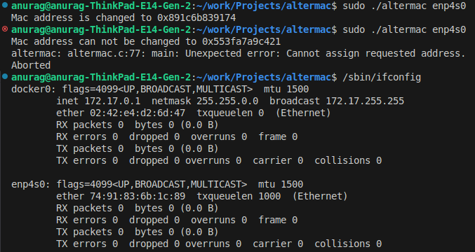

## AlterMac - MAC Address Chnager
This is a simple C program that generates a random MAC address and changes the MAC address of a specified network interface.

### Features
1. Generates a random 48-bit MAC address
2. Changes the MAC address of a given network interface
3. Uses system calls to interact with the network interface

### Requirements
1. GCC compiler for the C language
2. Linux based operating system
3. Superuser (root) privileges to change the MAC address of a network interface

### Compilation and Execution
1. Run the `make` command to generate the binary files.
2. Run the `sudo ./altermac interface_name` command for changing the MAC address for the specified interface.
You can check the name of your interfaces by running the `/sbin/ifconfig` command.

### Demo of the application

